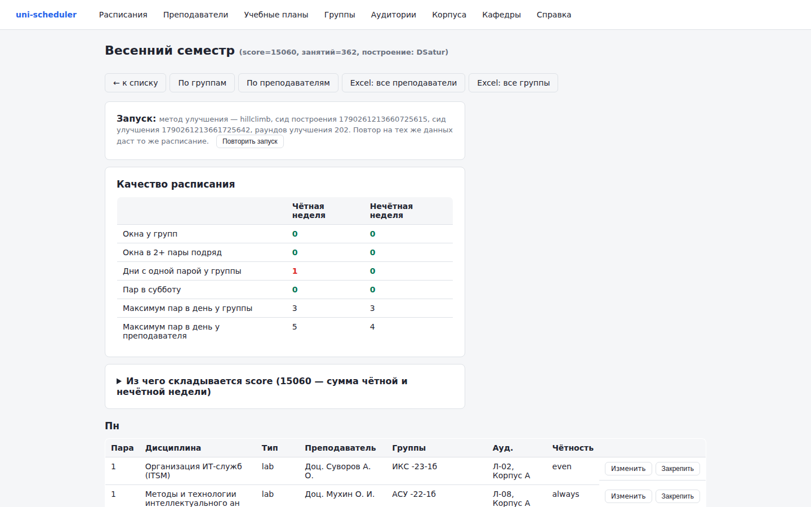
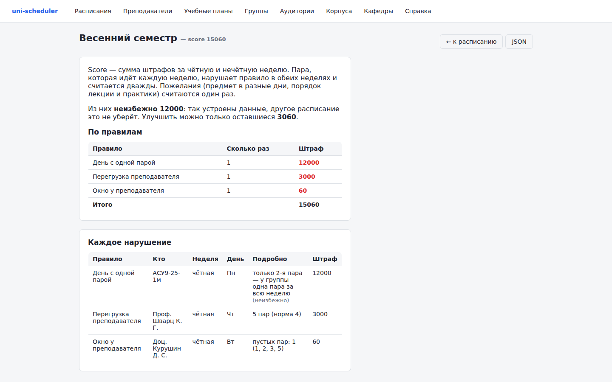
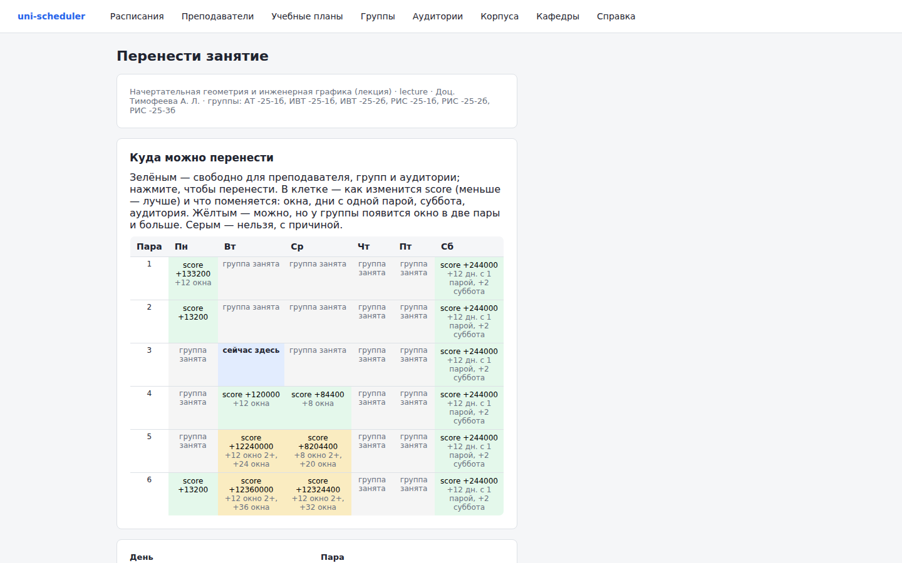
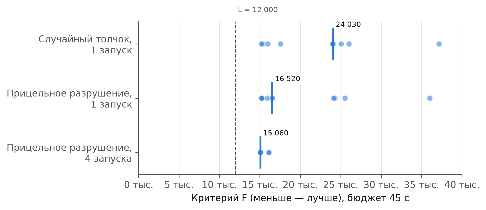

# uni-scheduler

**Автоматическое составление недельного расписания занятий кафедры вуза** — с чередованием
чётных и нечётных недель, потоковыми лекциями, корпусами, занятостью преподавателей на других
факультетах, ручной правкой и объяснением каждого нарушения.

На реальных данных кафедры (39 групп, 51 преподаватель, 362 пары в неделю) за 45 секунд
система ставит **все пары** без накладок, **без окон у студентов, без окон в две пары и без суббот**
и находит расписание в пределах **3 000 штрафных баллов от нижней границы** — всё, что
осталось, это мелочи вроде окна у преподавателя. [Подробнее о замерах →](docs/results/)



## Что умеет

- **Составляет расписание** за 1–2 минуты: построение (DSatur или по преподавателям) и
  улучшение одним из пяти методов — итерационный локальный поиск (по умолчанию), имитация
  отжига, табу-поиск, генетический алгоритм, LNS. По умолчанию — 4 параллельных запуска,
  берётся лучший.
- **Объясняет оценку.** Каждое нарушение — отдельной строкой: правило, группа или
  преподаватель, неделя, день, что именно и сколько стоит. Нарушения, которые не убрать
  никаким расписанием (например, у группы одна пара за всю неделю), помечены «неизбежно», и
  видно, сколько ещё можно улучшить.

  

- **Помогает править вручную.** Для любой пары показывает все 36 слотов: куда можно перенести,
  что мешает и как изменятся оценка, окна и дни с одной парой. Аудиторию можно выбрать
  только подходящую паре по типу, вместимости и корпусу — лекцию потока не поставить в класс на 30 мест.

  

- **Закрепление и перегенерация.** Удачные пары можно закрепить и составить остальное заново
  вокруг них.
- **Воспроизводимость.** Каждое расписание хранит сиды и число раундов улучшения; кнопка
  «Повторить запуск» даёт то же расписание пара в пару, на любой машине.
- **Проверка данных до генерации:** ошибки в планах, нехватка времени у преподавателя,
  группы, у которых день с одной парой неизбежен.
- **Пожелания преподавателей:** недоступное время (жёстко), нежелательное время (по
  возможности), пары на других факультетах с учётом чётности.
- **Excel:** импорт справочников; выгрузка по преподавателям, группам, курсу, отдельной неделе.
- **REST API** для всех операций; работа в локальной сети **без интернета**.

## Как это устроено

**Модель.** Сетка 6 дней × 6 пар; у группы фактически два расписания — чётной и нечётной
недели (на данных кафедры 70 % пар идут через неделю). Жёсткие ограничения (преподаватель,
группа, аудитория не заняты дважды; тип, вместимость и корпус аудитории; недоступность
преподавателя; нет окон в две пары) не нарушаются никогда. Мягкие требования — окна, дни с
одной парой, перегрузка и неравномерность дней, переходы между корпусами, суббота, окна
преподавателей — штрафуются; score — сумма штрафов обеих недель.

**Методы.**
1. *Построение DSatur* — на каждом шаге ставится самая трудная пара (с наименьшим числом
   свободных слотов); слот выбирается эвристикой, которая оставляет место следующим парам.
2. *Инкрементальная оценка* — штрафы разложены по группам и преподавателям, ход
   пересчитывает только затронутых: **в 17 раз быстрее** полного пересчёта.
3. *Итерационный локальный поиск с прицельным разрушением* — вместо случайного толчка
   снимаются пары группы с днём с одной парой вместе со связанными потоками и ставятся
   заново: **медиана оценки −31 %**.
4. *Нижняя граница* — неустранимые нарушения показывают, насколько решение далеко от
   лучшего возможного.



**Архитектура** — гексагональная (порты и адаптеры): алгоритмы не зависят от базы данных и
интерфейса, поэтому тестируются и исследуются на реальных данных без инфраструктуры.
Сценарии разделены на команды и запросы, по пакету на сценарий.

```
cmd/                           точка входа; cmd/bench — замеры методов
internal/core/domain/          предметная область
internal/core/solver/          модели и методы (карта пакета — doc.go)
internal/core/application/     сценарии: commands/<сценарий>, queries/<запрос>
internal/core/ports/           интерфейсы хранилищ
internal/adapters/in/http/     веб-интерфейс и REST API
internal/adapters/in/excel/    импорт Excel
internal/adapters/out/postgres/ хранилище
migrations/                    схема БД
```

Стек: **Go 1.25, PostgreSQL 16**, серверные шаблоны без внешних JS-библиотек, excelize, Docker.

## Запуск

Нужен Docker с `docker compose`.

```bash
make up          # собрать образ и запустить postgres + приложение
make seed        # залить справочники из data/snapshots (очищает справочники!)
make demo        # запуск из уже собранного образа, без интернета
make test        # go build + go vet + go test
```

Интерфейс: http://localhost:8080/ui/schedules

Установка на сервер — [deploy/README.md](deploy/README.md): без интернета — из пакета
`make package` → `dist/uni-scheduler.tar.gz` (образы, compose, база со справочниками); с интернетом —
сборка образа на сервере из репозитория и `scheduler seed` для справочников кафедры.

## Документация

- [docs/results/](docs/results/) — замеры на реальных данных, графики, как повторить.
- [docs/adr/](docs/adr/) — 23 архитектурных решения: почему сделано так, от чего отказались,
  чем подтверждено.
- [docs/spec/](docs/spec/) — требования, модель данных, алгоритм с весами штрафов, API,
  развёртывание.
- Раздел «Справка» в интерфейсе — для пользователя.

## REST API

База `/api/v1`: генерация `POST /schedules/generate`, разбор оценки
`GET /schedules/{id}/violations`, подсказка и перенос пары `GET …/assignments/{idx}/options`,
`PATCH …/assignments/{idx}`, закрепление `PUT …/pinned`, повтор `POST /schedules/{id}/replay`,
Excel `GET /schedules/{id}/excel`, проверка данных `GET /input/check`, справочники CRUD.
Полный контракт — [docs/spec/04-api-contracts.md](docs/spec/04-api-contracts.md).

```json
POST /api/v1/schedules/generate
{ "name": "Осень 2026", "timeout_sec": 120, "solver_type": "dsatur",
  "improve_algo": "hillclimb", "parallel_starts": 4 }
```
