# Диаграммы системы автоматического составления расписания занятий

**Тема дипломной работы:** Проектирование и разработка моделей и методов системы автоматического составления расписания занятий  
**Язык реализации:** Go 1.22+  
**СУБД:** PostgreSQL 16

---

## 1. Диаграмма вариантов использования (Use Case)

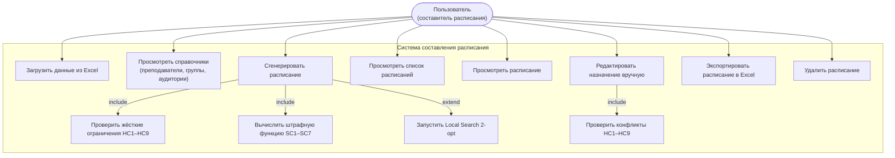

---

## 2. ER-диаграмма (Концептуальная модель данных)

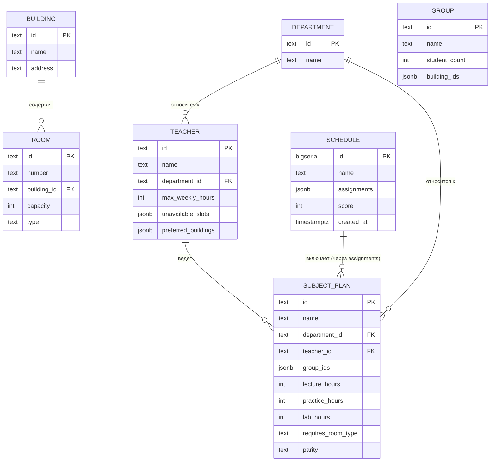

> **Примечание.** Поля типа `jsonb` используются для хранения массивов идентификаторов (`group_ids`, `building_ids`) и вложенных объектов (`assignments`, `unavailable_slots`). Это позволяет избежать дополнительных связующих таблиц и обеспечивает гибкость при изменении структуры данных.

---

## 3. Компонентная диаграмма (Архитектура системы)

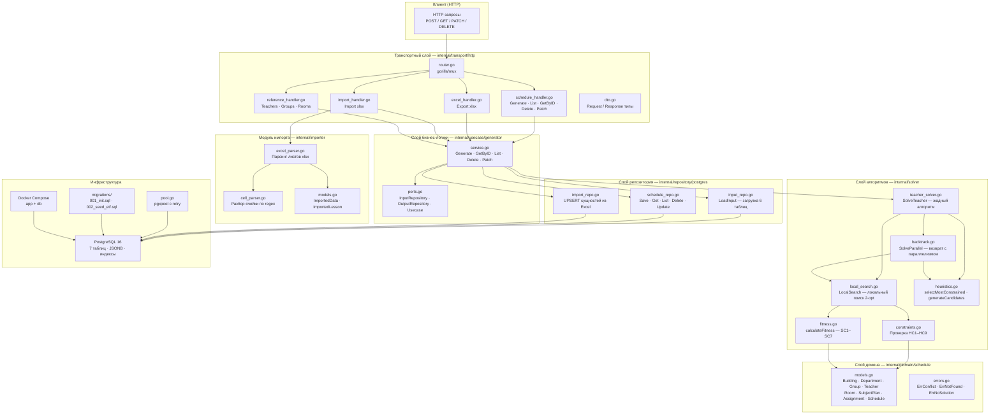

---

## 4. Блок-схема алгоритма генерации расписания

### 4.1 Основной алгоритм (Teacher-Driven Greedy)

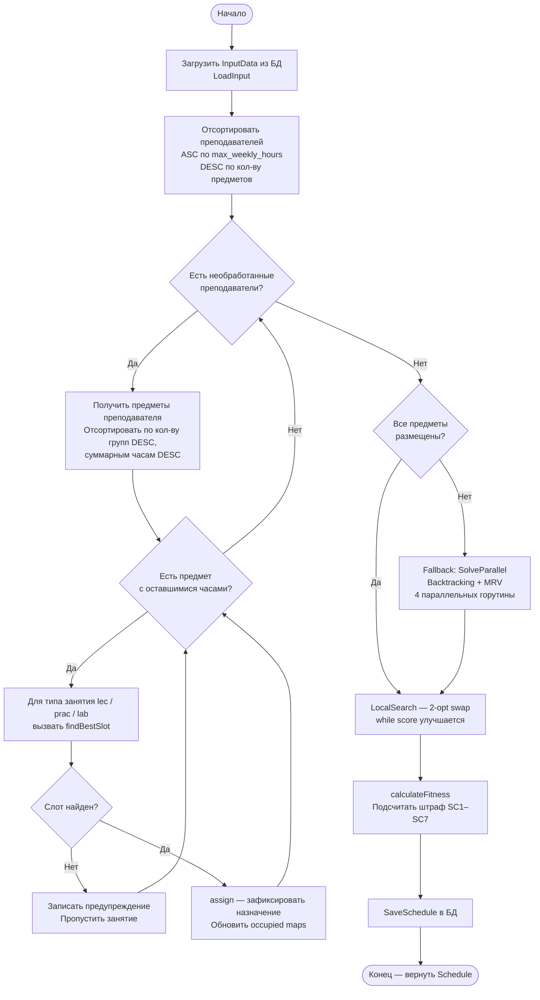

### 4.2 Функция findBestSlot (выбор слота)

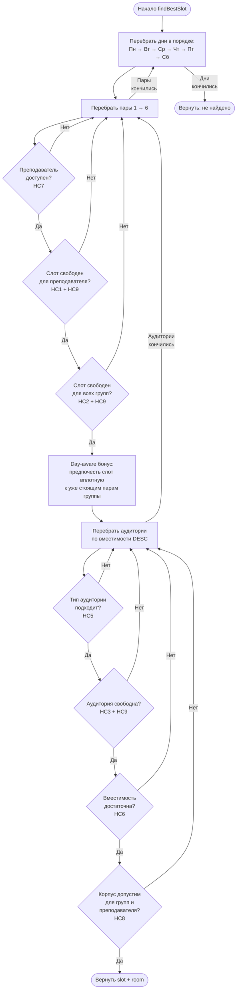

### 4.3 Local Search 2-opt

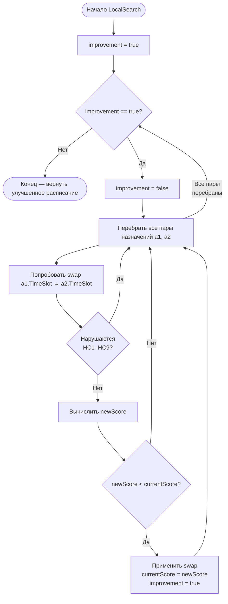

---

## 5. Диаграммы последовательностей

### 5.1 Генерация расписания

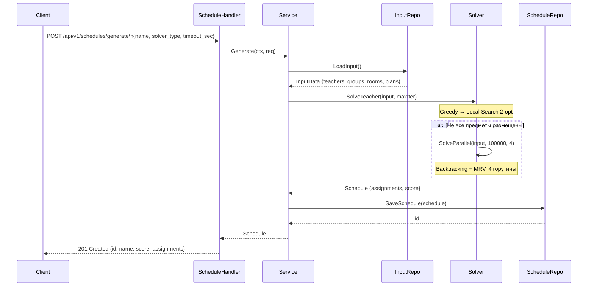

### 5.2 Импорт данных из Excel

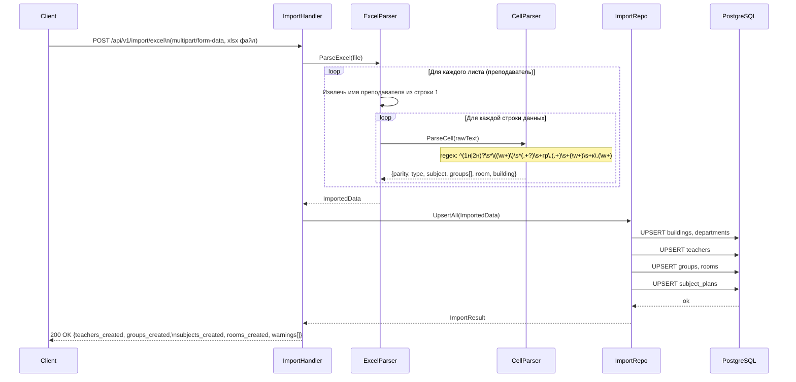

### 5.3 Ручное редактирование назначения

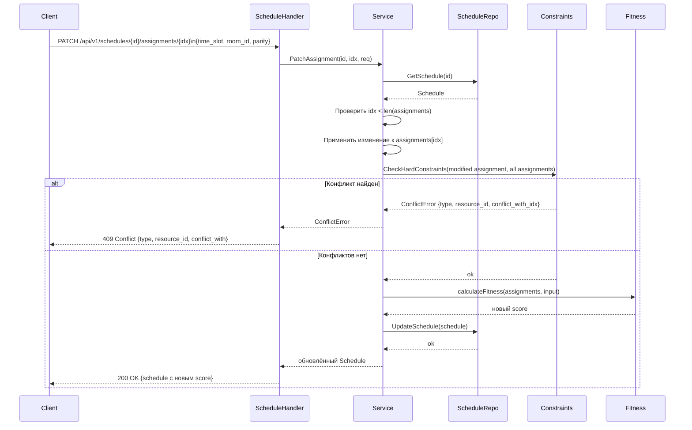

### 5.4 Экспорт расписания в Excel

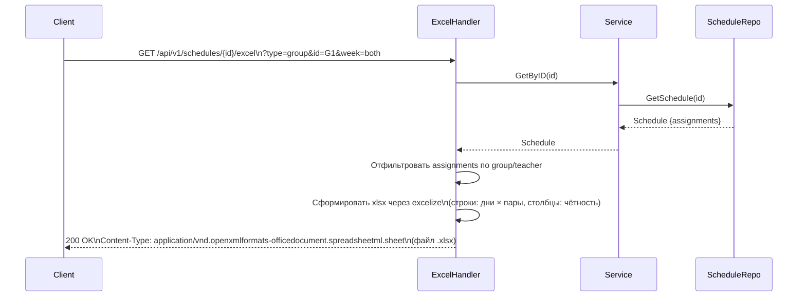

---

## 6. Диаграмма состояний расписания

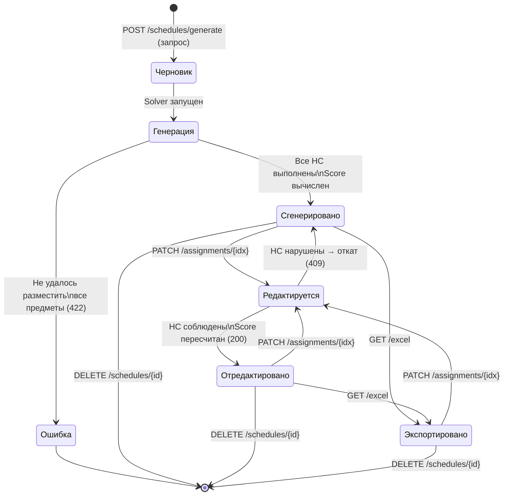

---

## 7. Схема базы данных (DDL)

```sql
-- Корпуса
CREATE TABLE buildings (
    id      TEXT PRIMARY KEY,
    name    TEXT NOT NULL,
    address TEXT
);

-- Кафедры
CREATE TABLE departments (
    id   TEXT PRIMARY KEY,
    name TEXT NOT NULL
);

-- Учебные группы
CREATE TABLE groups (
    id            TEXT PRIMARY KEY,
    name          TEXT NOT NULL,
    student_count INT  NOT NULL DEFAULT 25,
    building_ids  JSONB NOT NULL DEFAULT '[]'
);

-- Преподаватели
CREATE TABLE teachers (
    id                  TEXT PRIMARY KEY,
    name                TEXT NOT NULL,
    department_id       TEXT REFERENCES departments(id),
    max_weekly_hours    INT  NOT NULL DEFAULT 18,
    unavailable_slots   JSONB NOT NULL DEFAULT '[]',
    preferred_buildings JSONB NOT NULL DEFAULT '[]'
);

-- Аудитории
CREATE TABLE rooms (
    id          TEXT PRIMARY KEY,
    number      TEXT NOT NULL,
    building_id TEXT NOT NULL REFERENCES buildings(id),
    capacity    INT  NOT NULL DEFAULT 30,
    type        TEXT NOT NULL CHECK (type IN ('lecture', 'lab', 'pc'))
);

-- Учебные планы
CREATE TABLE subject_plans (
    id                 TEXT PRIMARY KEY,
    name               TEXT NOT NULL,
    department_id      TEXT REFERENCES departments(id),
    teacher_id         TEXT NOT NULL REFERENCES teachers(id),
    group_ids          JSONB NOT NULL DEFAULT '[]',
    lecture_hours      INT  NOT NULL DEFAULT 0,
    practice_hours     INT  NOT NULL DEFAULT 0,
    lab_hours          INT  NOT NULL DEFAULT 0,
    requires_room_type TEXT NOT NULL DEFAULT 'lecture'
                           CHECK (requires_room_type IN ('lecture', 'lab', 'pc')),
    parity             TEXT NOT NULL DEFAULT 'always'
                           CHECK (parity IN ('always', 'even', 'odd'))
);

-- Готовые расписания
CREATE TABLE schedules (
    id          BIGSERIAL PRIMARY KEY,
    name        TEXT NOT NULL,
    assignments JSONB NOT NULL DEFAULT '[]',
    score       INT  NOT NULL DEFAULT 0,
    created_at  TIMESTAMPTZ NOT NULL DEFAULT NOW()
);

-- Индексы
CREATE INDEX idx_subject_plans_teacher ON subject_plans(teacher_id);
CREATE INDEX idx_schedules_score       ON schedules(score ASC);
```

---

## 8. Таблица жёстких ограничений

| № | Ограничение | Проверяемый ресурс | Функция |
|---|---|---|---|
| HC1 | Преподаватель не ведёт два занятия в один слот × чётность | Teacher | `isSlotFree(teacher)` |
| HC2 | Группа не имеет двух занятий в один слот × чётность | Group | `isSlotFree(group)` |
| HC3 | Аудитория не используется двумя занятиями одновременно | Room | `isSlotFree(room)` |
| HC4 | Кол-во пар каждого типа не превышает лимит SubjectPlan | SubjectPlan | `getRemainingHours()` |
| HC5 | Тип аудитории соответствует требованию предмета | Room | `isRoomSuitable()` |
| HC6 | Вместимость аудитории ≥ суммарное число студентов групп | Room | `isRoomBigEnough()` |
| HC7 | Преподаватель не назначается в слот из UnavailableSlots | Teacher | `isTeacherAvailable()` |
| HC8 | Аудитория находится в корпусе, допустимом для всех групп | Building | `isBuildingAllowed()` |
| HC9 | Чётность занятия (even/odd/always) учитывается при проверке конфликтов | Parity | `parityConflicts()` |

---

## 9. Таблица мягких ограничений и штрафной функции

| № | Ограничение | Штраф | Обоснование веса |
|---|---|---|---|
| SC1 | Пара поставлена в субботу | +200 за пару | Нежелательно, но допустимо |
| SC2 | День группы длиннее 4 пар подряд | +300–500 | Высокая учебная нагрузка |
| SC3 | Концентрация нагрузки (мало дней) | +200–600 | Неравномерность по неделе |
| SC4 | Окна у групп (gap между парами в день) | **+10 000 × N** | Критично: студенты ждут впустую |
| SC5 | Окна у преподавателей | +60 × N | Нежелательно, меньший приоритет |
| SC6 | Переход между корпусами в смежных парах | +150 | Физически затруднён за 10 мин |
| SC7 | Одна пара в день у группы («форточка») | +25 | Минимальный дискомфорт |

**Целевое значение:** `score < 10 000` при `placement_rate = 100%`

---

## 10. Описание формата входного файла Excel

### Структура листа (один лист = один преподаватель)

| Строка | Содержимое |
|---|---|
| 0 | Заголовок: «Расписание занятий на 2024/25 уч. год (кафедра ИТАС)» |
| 1 | «Преподаватель Доц. Петренко А.А.» |
| 2 | Заголовки столбцов: Дни / Часы / Дисциплина, группа, аудитория |
| 3+ | Данные (forward-fill для столбца «Дни») |

### Формат ячейки занятия

```
[чётность] (тип) название_предмета гр.ГРУППА [, ГРУППА2] аудитория к.КОРПУС (кафедра)
```

**Примеры:**

```
(лаб) Дискретная математика гр.РИС -23-2б 226 к.А (ЭТФ)
1н (лаб) Объектно-ориентированное программирование гр.РИС -23-1б 128 к.А (ЭТФ)
(лек) Сети и телекоммуникации гр.АСУ -22-1б, ИКС -22-1б, РИС -22-1б 402 к.А (ЭТФ)
```

Если в одном слоте две записи (чётная/нечётная неделя) — разделены символом `\n`.

### Регулярное выражение для разбора ячейки

```
^(1н|2н)?\s*\((\w+\.?)\)\s*(.+?)\s+гр\.([\w,\s\-\/]+)\s+(\w+)\s+к\.(\w+)
```

| Группа | Значение | Пример |
|---|---|---|
| `$1` | Чётность (1н / 2н / пусто) | `1н` |
| `$2` | Тип занятия | `лаб` |
| `$3` | Название предмета | `Дискретная математика` |
| `$4` | Группы через запятую | `РИС -23-1б, РИС -23-2б` |
| `$5` | Номер аудитории | `226` |
| `$6` | Корпус | `А` |

### Маппинги

```
Дни:      ПОНЕДЕЛЬНИК→monday, ВТОРНИК→tuesday, СРЕДА→wednesday,
          ЧЕТВЕРГ→thursday, ПЯТНИЦА→friday, СУББОТА→saturday

Часы:     8:00→1, 9:40→2, 11:30→3, 13:20→4, 15:00→5, 16:40→6

Типы:     лек→lecture, лаб→lab, пр→practice, кср→practice, у.л.→lecture

Чётность: 1н→odd, 2н→even, (пусто)→always
```

---

## 11. Нефункциональные требования и метрики качества

| Метрика | Описание | Целевое значение |
|---|---|---|
| `score` | Суммарный штраф по SC1–SC7 | < 10 000 |
| `gap_ratio` | Доля пар групп с окнами / всего пар | < 5% |
| `saturday_ratio` | Доля пар в субботу | < 2% |
| `placement_rate` | Доля размещённых предметов | 100% |
| `solve_time_ms` | Время работы алгоритма | < 30 000 мс |

| Требование | Значение |
|---|---|
| Язык реализации | Go 1.22+ |
| СУБД | PostgreSQL 16 |
| Контейнеризация | Docker Compose |
| HTTP-фреймворк | gorilla/mux v1.8.1 |
| Драйвер БД | jackc/pgx v5 |
| Работа с Excel | xuri/excelize v2 |
| Покрытие unit-тестами | > 70% (solver, parser) |
