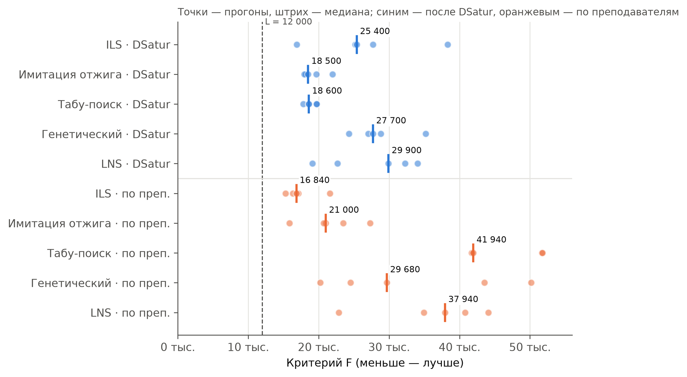
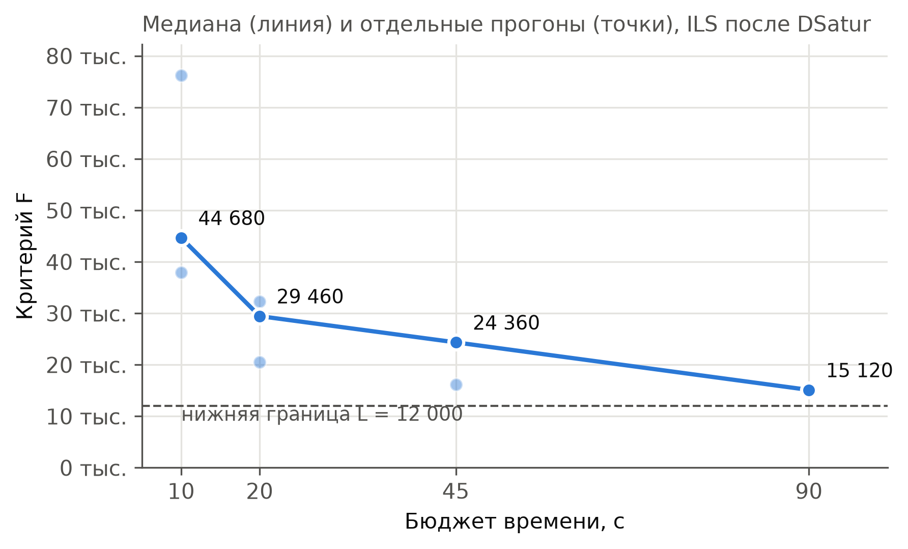

# Результаты на реальных данных

Замеры на снимке справочников кафедры (`data/snapshots`): 39 групп, 51 преподаватель,
31 аудитория, 320 учебных планов — **362 пары в неделю**, из них 252 идут только по чётным
или только по нечётным неделям. Машина: 4 ядра Xeon 2,8 ГГц.

Score — сумма штрафов за чётную и нечётную неделю (ADR-0020), меньше — лучше.
**Нижняя граница — 12 000**: у одной магистерской группы в чётную неделю всего одна пара, и
день с одной парой у неё будет при любом расписании (ADR-0021, пометка «неизбежно»).

## Итог

| Режим по умолчанию | Результат |
|---|---|
| DSatur + ILS с прицельным разрушением, 4 параллельных запуска, 45 с | медиана **15 060** (15 000–16 100), все пары поставлены, нет окон в 2+ пары и суббот |
| До нижней границы | около 3 000 — только мелкие нарушения (окна у преподавателей, неравномерность недели) |
| Оценка одного хода | 16,5 мкс инкрементально против 277,5 мкс полным пересчётом — **в 17 раз быстрее** |

## Методы улучшения



5 прогонов по 45 с, один запуск. Имитация отжига и табу-поиск после DSatur — самые
кучные; ILS находит лучшие значения, но с разбросом, который убирают параллельные запуски.

## Прицельное разрушение-восстановление (ADR-0021)


ILS после DSatur, 45 с: случайный толчок — медиана 24 030; прицельное разрушение групп с
днём с одной парой — 16 520 (−31 %); плюс 4 параллельных запуска — 15 060.

## Бюджет времени



## Как повторить

```sh
# методы × построения
go run ./cmd/bench -snapshots data/snapshots -construct teacher,dsatur \
  -methods hillclimb,sa,tabu,ga,lns -runs 5 -budget 45s > main.csv
# без прицельного разрушения / с 4 запусками
go run ./cmd/bench -snapshots data/snapshots -construct dsatur -methods hillclimb -runs 10 -budget 45s -no-targeted
go run ./cmd/bench -snapshots data/snapshots -construct dsatur -methods hillclimb -runs 5 -budget 45s -starts 4
# скорость оценки хода
go test ./internal/core/solver -run xxx -bench BenchmarkMove
# графики из data/*.csv
python3 docs/results/figures/make_figures.py
```

Каждое расписание хранит сиды и число раундов улучшения, так что конкретный результат можно
повторить пара в пару (ADR-0023).
