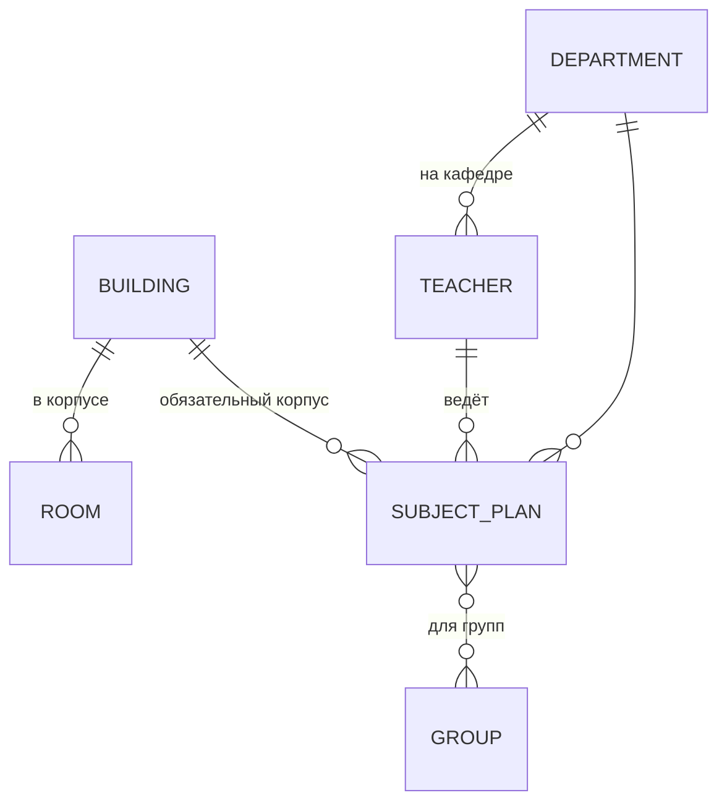

# Модель данных

## Входные данные



| Сущность | Ключевые поля | Влияние на расписание |
|---|---|---|
| Корпус | название | переходы между корпусами |
| Аудитория | номер, корпус, вместимость, тип (`lecture`, `lab`, `gym`, `outdoor`) | тип и вместимость — жёсткие ограничения; `gym`/`outdoor` не штрафуются за переходы |
| Группа | название, число студентов, допустимые корпуса | вместимость, корпус |
| Преподаватель | ФИО, кафедра, недоступные слоты, допустимые корпуса | HC7, порядок обработки |
| Учебный план | предмет, преподаватель, группы, часы лекций/практик/лаб в неделю, тип аудитории, чётность, половина семестра, обязательный корпус | единица нагрузки: одна пара на 2 часа |

**Чётность** плана: `always` — каждую неделю, `even`/`odd` — через неделю. У чётной и нечётной
недели своё расписание: пары `always` плюс пары своей чётности.

**Связь лекции и практики** — по названию предмета без пометки вида в скобках (`subjectKey`).

## Выходные данные

`schedules`:

| Колонка | Тип | Содержимое |
|---|---|---|
| `id` | bigserial | |
| `name` | text | название от пользователя |
| `assignments` | jsonb | массив пар |
| `score` | int | итоговый штраф |
| `unplaced` | jsonb | непоставленные пары: план, вид, недостающие часы; `NULL` у старых расписаний |
| `options` | jsonb | включённые дополнительные правила; `{}` у старых (миграция 0005) |
| `created_at` | timestamptz | |

Пара (`Assignment`):

```json
{
  "group_ids": ["…"],
  "teacher_id": "…",
  "room_id": "…",
  "subject_id": "…",
  "type": "lecture | practice | lab",
  "time_slot": { "day": "monday", "pair_num": 1 },
  "parity": "always | even | odd",
  "building_id": "…"
}
```

Почему одним JSONB-полем — ADR-0010.

## Миграции
| Файл | Что делает |
|---|---|
| 0001_init | таблицы и демо-справочники |
| 0002 | **не подключается**: дублирует 0001 и конфликтует по первичному ключу |
| 0003 | половина семестра, обязательный корпус предмета |
| 0004 | `schedules.unplaced` |
| 0005 | `schedules.options` |

Миграции применяются только при создании тома БД (`docker-entrypoint-initdb.d`).
