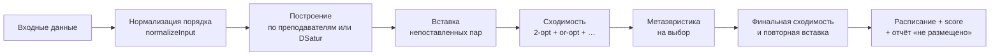

# Алгоритм составления расписания

Код: `internal/core/solver/`. Вход — `domain.InputData`, выход — список пар (`Assignment`) и score.
Солвер один (ADR-0007), построение начального расписания — на выбор из двух (ADR-0015).

## Общая схема

## 1. Нормализация
Справочники сортируются по ID: построение зависит от порядка при равных штрафах, а порядок строк
из БД не гарантирован (ADR-0008).

## 2. Построение

Алгоритм построения выбирается параметром `solver_type` (ADR-0015, по умолчанию DSatur — ADR-0019):

| Значение | Построение |
|---|---|
| `dsatur`, пусто | самая трудная пара первой (DSatur) — порядок пересчитывается после каждой пары |
| `teacher` | по преподавателям — пары идут блоками по преподавателю |

Оба ставят очередную пару одинаково — в допустимый слот с наименьшим `slotPenalty` (ниже);
различается только порядок пар.

### 2.1. По преподавателям

**Порядок преподавателей** — по гибкости: `(36 − недоступных слотов) / нужных часов`, от меньшей
к большей; при равенстве — у кого больше планов. Раньше всех обрабатываются те, кому сложнее найти
время.

**Порядок пар преподавателя** — лекции, затем практики, затем лабораторные; внутри вида — планы
с большим числом групп раньше.

**Выбор слота.** Для пары перебираются все слоты (дни по возрастанию загрузки, суббота последней).
Слот допустим, если свободны преподаватель, все группы плана и подходящая аудитория с учётом
чётности, и преподаватель не отметил его недоступным. Из допустимых выбирается слот с наименьшим
штрафом `slotPenalty`, аудитория — подходящего типа с наименьшим избытком мест.

Нет допустимого слота — пара уходит в «Не размещено»; состав плана не делится (ADR-0002).

### 2.2. DSatur — самая трудная пара первой

Расписание рассматривается как раскраска графа: вершины — пары, цвета — слоты, рёбра — общий
преподаватель или группа. Для каждой непоставленной пары известно число допустимых слотов
(свободны преподаватель, все группы и подходящая аудитория, слот не отмечен недоступным).
На каждом шаге ставится пара с наименьшим числом; при равенстве — с большим числом групп, затем
с большей степенью (сколько других пар делят с ней преподавателя или группу), затем лекции
раньше практик и лабораторных. Постановка меняет занятость только в одном слоте, поэтому после
неё у остальных пар перепроверяется только он.

С ненулевым зерном (несколько стартов) пары с полностью равным приоритетом перемешиваются.

### 2.3. Вставка непоставленных пар

После построения и ещё раз в конце улучшения пары из «Не размещено» ставятся заново, трудные
первыми: в лучший свободный слот пн–пт, затем в субботу. Если свободного нет — вытеснение: в слоте
снимаются мешающие пары (тот же преподаватель или группа, не больше трёх), пара встаёт на их
место, снятые переставляются в лучшие свободные слоты. Вариант принимается, только если вернулись
все снятые; из удачных берётся лучший по score. Поставить пару важнее score.

### 2.4. Штраф слота при построении (`slotPenalty`)

Считается по каждой учебной неделе, в которую идёт пара, и усредняется (ADR-0009):

| Составляющая | Значение |
|---|---|
| Окно, которое создаст пара у группы | 10 000 за окно |
| Окно в 2+ пары подряд (HC8) | 1 000 000 — выбирается, только если другого слота нет |
| У группы в этот день уже 0 / 1 / 2 / 3 / 4+ пар | 1500 / 0 / 1000 / 15 000 / 50 000 |
| Переход в другой корпус вплотную / через окно (кроме спортзала и стадиона) | 2000 / 700 |
| Пары преподавателя в этот день | 100 за пару; +20 000, если уже 4 |

Вне недельного усреднения:

| Составляющая | Значение |
|---|---|
| Суббота | 25 000; +40 000 за каждую группу, у которой ещё нет субботних пар |
| Общая загрузка дня | 20 за каждую пару в этот день |
| Дополнительные правила (если включены) | 2000 / 2000 / 3000 (ADR-0006) |

Веса построения отличаются от весов оценки намеренно: построение выбирает место для следующей
пары, видя только уже поставленные; оценка судит готовое расписание целиком.

### 2.5. Закреплённые пары

При перегенерации (`base_schedule_id`) закреплённые пары ставятся первыми как есть и засчитываются
в план; построение ставит остальные вокруг них. При улучшении ни один ход не меняет слот и
аудиторию закреплённой пары (`evaluator.apply`), LNS не снимает её, вставка не вытесняет (ADR-0018).

## 3. Улучшение

**Инкрементальная оценка** (`evaluator.go`, ADR-0014). Расписание хранится вместе с индексом
занятости (преподаватель / группа / аудитория × слот × неделя) и штрафами, разложенными по
группам и преподавателям. Ход пересчитывает только затронутые группы и преподавателя; жёсткие
ограничения проверяются по индексу. Значение совпадает с `calculateFitness` (тест
`TestEvaluator_MatchesFullFitness`).

**Окрестности** (сходимость перебирает их по очереди, пока score уменьшается):
- **2-opt** — обмен слотами двух пар, аудитории остаются за парами;
- **or-opt** — перенос пары в любой другой слот пн–пт, в том числе в тот же день; если её
  аудитория там занята — в другую допустимую аудиторию;
- **смена аудитории** — пара остаётся в слоте, переходит в другую допустимую аудиторию
  (меняет переходы между корпусами);
- **обмен днями группы** — все пары группы из одного дня переезжают в другой на те же номера
  и наоборот. Одиночные ходы такого не находят: каждый промежуточный шаг создаёт окна.

Допустимые аудитории пары считаются теми же проверками, что при построении (HC4–HC6), поэтому
смена аудитории их не нарушает. HC1–HC3 и HC7 проверяются на каждом ходе; HC8 — на каждом
переносе между слотами: ход, после которого длинных окон у затронутых групп больше, чем было,
отвергается.

**Метаэвристики** (ADR-0012, ADR-0014):

| Метод | Параметры |
|---|---|
| Iterated local search | толчок из 2–4 случайных ходов, растёт с застоем; равный score принимается; остановка после 60 неудач подряд |
| Имитация отжига | T₀ — при которой средний ухудшающий ход принимается с вероятностью 0,3; охлаждение по времени до T = 3 к концу бюджета; возврат к лучшему после 50·n ходов без улучшения; использует весь бюджет |
| Табу-поиск | 100 соседей за итерацию; пара не возвращается в покинутый слот 10–20 итераций; остановка после 30 000 итераций без улучшения |
| Генетический | популяция 16, турнир из 3, 3 мутации и or-opt на потомка, до 2000 поколений, остановка после 150 без улучшения |
| LNS | снять 5–20% пар (случайно, связанные по потокам группы или преподаватели целиком), поставить заново трудные первыми в лучший слот, сходимость; остановка после 300 итераций без улучшения |

Случайные ходы метаэвристик — обмен (40%), перенос (40%), смена аудитории (10%), обмен днями
группы (10%).

**Старты** — по умолчанию 4 параллельных запуска, берётся лучший (ADR-0022).

**Бюджет** — таймаут генерации минус 15 с (по умолчанию 60 с при вызове солвера напрямую).
Отжиг, табу и генетический после бюджета делают финальную сходимость (до 5 с).

## 4. Оценка (score)

Сумма штрафов за мягкие требования; меньше — лучше. Для каждой учебной недели (пары «всегда»
плюс пары своей чётности) считается отдельно, итог — сумма двух недель (ADR-0020;
раньше — среднее, ADR-0009). Пожелания (предмет в разные дни, порядок лекции и практики)
считаются один раз. Разбор по каждому нарушению — `solver.ExplainScore`, сумма его
штрафов равна score.

| Составляющая | За что | Штраф |
|---|---|---|
| Окна в 2+ пары подряд (HC8) | только если построению было некуда деться | 1 000 000 за окно |
| День с одной парой | у группы в день одна пара | 12 000 |
| Окна у групп | пустая пара между занятиями группы в один день | 10 000 за окно |
| Суббота | каждая пара; одинокая субботняя пара у группы | 200; +8000 |
| Перегрузка дня группы | 4 пары; 5 и больше | 800; 2000 + 4000 за каждую сверх 4 |
| Длинный день | больше 4 пар подряд / больше 4 пар | 500 / 300 |
| Мало дней | в среднем больше 3 пар на учебный день, дней 1 / 2 (ADR-0022) | 600 / 200 |
| Неравномерная неделя | разница между самым загруженным и самым свободным учебным днём группы больше 1 пары | 300 за каждую пару сверх 1 |
| Нежелательное время преподавателя | пара в слоте, отмеченном у преподавателя как нежелательный | 500 |
| Перегрузка преподавателя | больше 4 пар в день | 3000 за каждую сверх 4 |
| Концентрация преподавателя | 4+ пар в неделю меньше чем в 3 дня | 400 за недостающий день |
| Окна у преподавателя | пустая пара между его занятиями | 60 |
| Переходы между корпусами | вплотную / через окно, без спортзала и стадиона | 2000 / 700 |
| Дополнительные правила | только если включены | 2000 / 2000 / 3000 |

День с одной парой (12 000) дороже окна в одну пару (10 000): подождать пару лучше, чем ехать
ради одной (ADR-0016, заменяет соотношение из ADR-0003). Поиску выгодно склеить два одиночных
дня в один день с окном — это считается улучшением.

## 5. Жёсткие ограничения

| Код | Ограничение | Где проверяется |
|---|---|---|
| HC1 | преподаватель не ведёт две пары одновременно (с учётом чётности) | построение, каждый ход, ручной перенос |
| HC2 | группа не на двух парах одновременно | то же |
| HC3 | аудитория не занята дважды | то же |
| HC4 | тип аудитории соответствует плану | построение, ручной перенос в другую аудиторию |
| HC5 | вместимость; для потока из 3+ групп допускается до 1,5 вместимости | построение, ручной перенос в другую аудиторию |
| HC6 | корпус: обязательный корпус предмета, корпуса групп, корпуса преподавателя | построение, ручной перенос в другую аудиторию |
| HC7 | слот не отмечен преподавателем как недоступный и не занят его парой на другом факультете в ту же неделю (с учётом чётности) | построение, каждый ход, ручной перенос |
| HC8 | у группы нет окна в 2+ пары подряд (в каждой учебной неделе) | каждый перенос при улучшении; построение нарушает, только если пару иначе некуда поставить, — тогда штраф 1 000 000 |
| — | занятие плана — одной парой всем его группам | построение |

Операторы улучшения меняют время пары и выбирают аудиторию только из допустимых для неё,
поэтому HC4–HC6 при них не нарушаются. При ручном переносе HC4–HC6 проверяются, только если меняется аудитория:
перенос одного времени у старого расписания с неподходящей аудиторией не запрещается.
