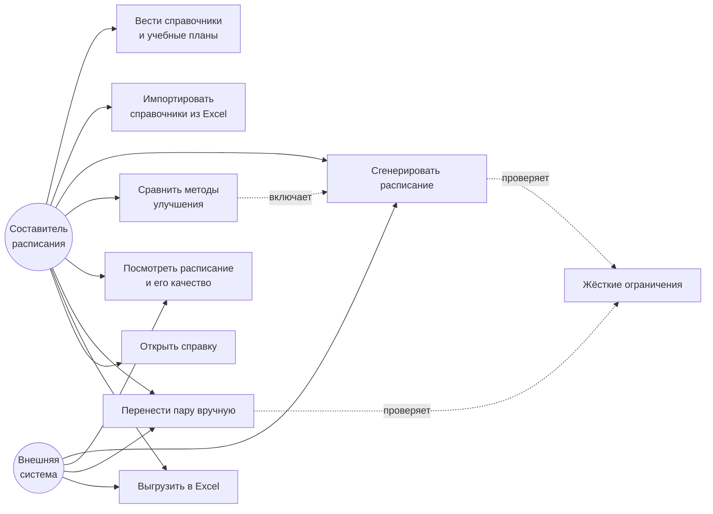
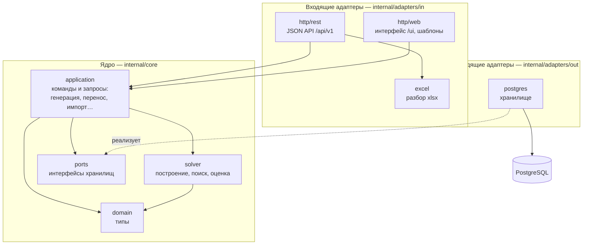
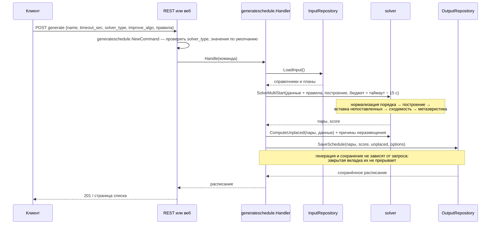
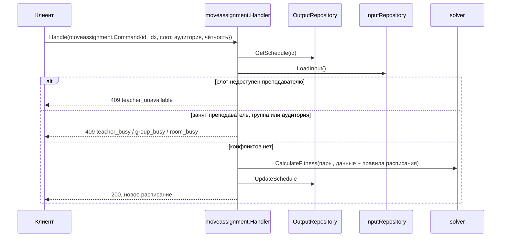
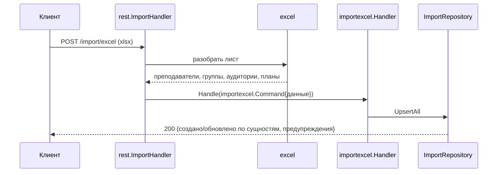
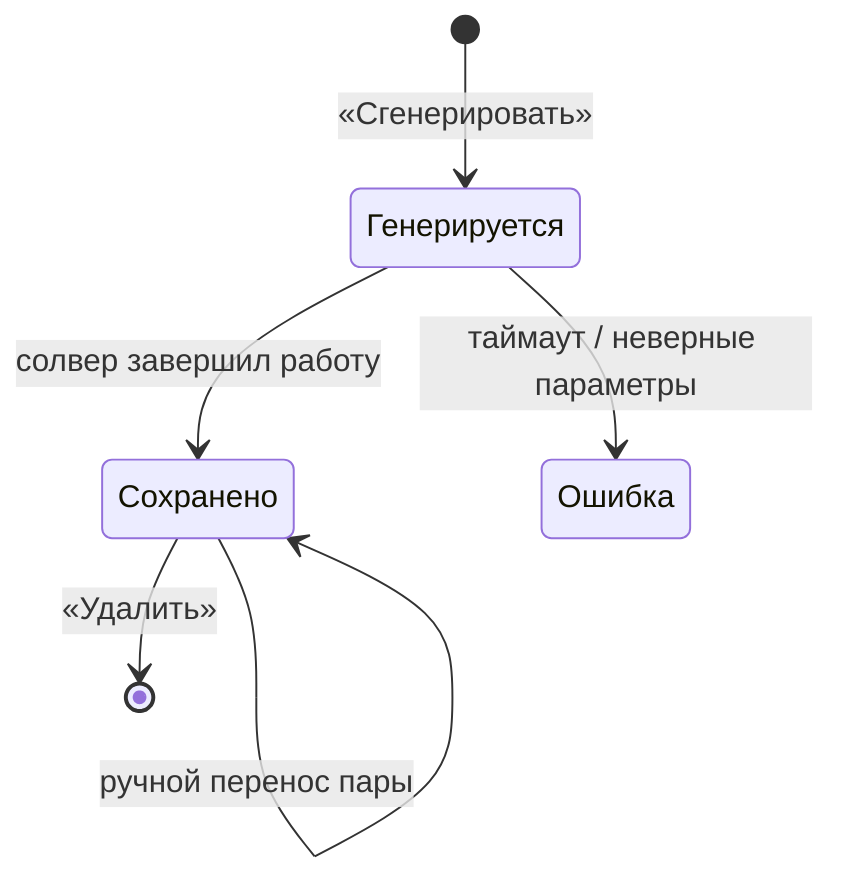

# Диаграммы

Все диаграммы описывают текущий код. ER-диаграмма — в [02-data-model.md](02-data-model.md),
схема алгоритма — в [03-algorithm.md](03-algorithm.md).

## Варианты использования

## Компоненты

Гексагональная архитектура: ядро (`internal/core`) не импортирует адаптеры (ADR-0001).

## Генерация расписания

«Все методы — сравнить» запускает пять таких генераций параллельно, по одной на метод,
и сохраняет пять расписаний.

## Ручной перенос пары

## Импорт справочников из Excel

## Состояния расписания

